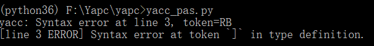
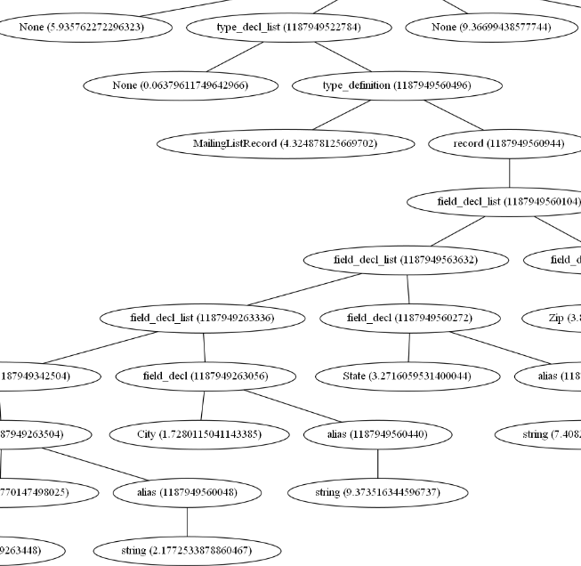

## 编译原理实验报告  

（封面或许最后再改下

------------ --------------------------------------
  课程名称：   编译原理

  姓 名：      李易非 陈俊儒 王丹尧

  学 院：      计算机学院

  系：         计算机科学与技术

  专 业：      计算机科学与技术(统计学交叉创新平台)

  学 号：     

  指导教师：   冯雁

------------ --------------------------------------

### 序言

（包括对整个编译器的描述，对所提交的各个文件的说明，组员的分工）

## 一、词法分析

### 1.1 关键字 

根据我们定义的pascal语法子集，对所需关键字进行了如下分类并将它们保存在reserved中。

~~~python
sys_con = ("false", "maxint", "true")
sys_funct = ("abs", "chr", "odd", "ord", "pred", "sqr", "sqrt", "succ")
sys_proc = ("write", "writeln")
sys_type = ("boolean", "char", "integer", "real")
key_word = (
    "and", "array", "begin", "case", "const", "do", "downto", "else", "end", "for", "function", "goto", "if", "in",
    "label", "mod", "not", "of", "or", "packed", "procedure", "program", "read", "record", "repeat", "set", "then",
    "to", "type", "until", "var", "while", "with", 'div')
~~~

### 1.2 符号标记

根据ply的语法规则，将语法中所用到的符号定义对应的标记符号TOKENS。标记TOKENS定义在最前面，以列表的形式存储。每种TOKEN用一个正则表达式规则来表示，每个规则需要以"t\_"开头声明，表示该声明是对标记的规则定义。对于简单的标记，可以直接定义：

~~~python
t_STRING = r'\".*\"'
t_ASSIGN = r':='
t_EQUAL = r'='
t_UNEQUAL = r'<>'
t_ADD = r'\+'
t_SUBTRACT = r'-'
t_MUL = r'\*'
t_DIV = r'/'
t_LB = r'\['
t_RB = r'\]'
t_LP = r'\('
t_RP = r'\)'
t_GE = r'>='
t_LE = r'<='
t_GT = r'>'
t_LT = r'<'
t_COMMA = r','
t_COLON = r':'
t_SEMICON = r';'
t_DOT = r'\.'
t_DOUBLEDOT = r'\.\.'
t_ignore = ' \t\r'
~~~

对于需要执行动作的符号标记，如整数、实数、字符串和ID等TOKENS，将规则写成一个方法。方法总是需要接受一个LexToken实例的参数，该实例有一个t.type的属性（字符串表示）来表示标记的类型名称，t.value是标记值（匹配的实际的字符串）。方法可以在方法体里面修改这些属性。但是，如果这样做，应该返回结果token，否则，标记将被丢弃。在这里我们使用了@TOKEN装饰器来引用已有的变量并定义规则。

定义如下：

~~~python
char = r'(\'([^\\\'\.]?)\')|(\"([^\\\"\.]?)\")'
identifier = r'[_a-zA-Z][_a-zA-Z0-9]*'
interger = r'\d+'
real = r'\d+\.\d+'
newline = r'\n+'
comment = r'{[\S\s\n]*?}'

@TOKEN(identifier)
def t_ID(t):
    # check for the reserved word
    t.type = reserved.get(t.value, 'ID')
    return t

@TOKEN(char)
def t_CHAR(t):
    t.value = t.value[1:-1]
    return t

@TOKEN(real)
def t_REAL(t):
    t.value = float(t.value)
    return t

@TOKEN(interger)
def t_INTEGER(t):
    t.value = int(t.value)
    return t

@TOKEN(newline)
def t_newline(t):
    t.lexer.lineno += len(t.value)

@TOKEN(comment)
def t_comment(t):
    # escape the comment
    pass

def t_error(t):
    print("Illegal char: `%s` at line %d" % (t.value[0], t.lexer.lineno))
    exit(-1)

# EOF handling rule
def t_eof(t):
    pass
~~~

### 1.3 匹配规则顺序

在lex内部，lex.py用re模块处理匹配模式，匹配顺序如下：

1\. 所有由方法定义的标记规则，按照他们的出现顺序依次加入

2\. 由字符串变量定义的标记规则按照其正则表达式长度倒序后，依次加入

## 二、语法分析

### 2.1 语法规则

我们对pascal定义了一个语法子集，下面是主要的文法规则：

#### 2.1.1 程序整体框架

~~~
program ： program_head  routine  DOT
program_head ： PROGRAM  ID  SEMI
routine ： routine_head  routine_body
routine_head ： const_part  type_part  var_part  routine_part
routine_body ： compound_stmt
compound_stmt ： BEGIN  stmt_list  END
~~~

我们用下面这个例子来解释上面的文法:

program由program_head和routine构成，其中Program_head包括程序第一行的program关键字和ID信息(例子中是“if_statement”)。routine则又包括routine_head和routine_body。其中routine_head可能包有const_part, type_part, var_part和routine_part这四个部分中的一个或多个，之后会对这几个部分进行进一步的文法规则阐释（例子中包含了var_part）。routine_body则是begin开始end结束的程序过程。

~~~pascal
program if_statement;
var x, y: integer;
begin
	x := 2;
    y := 15;
end.
~~~

#### 2.1.2 常量 const_part

~~~
const_part ： CONST  const_expr_list  |  ε
const_expr_list ： const_expr_list  NAME  EQUAL  const_value  SEMI
|  NAME  EQUAL  const_value  SEMI
const_value ： INTEGER  |  REAL  |  CHAR  |  SYS_CON

~~~

常量部分可能为空，非空时由const关键字开头，一串常量定义由分号连接，支持整数、实数、字符等类型，实例如下：

~~~pascal
const
    maxn=10000;
~~~

#### 2.1.3 类型 type_part

~~~
type_part ： TYPE type_decl_list  |  ε
type_decl_list ： type_decl_list  type_definition  |  type_definition
type_definition ： NAME  EQUAL  type_decl  SEMI
type_decl ： simple_type_decl  |  array_type_decl  |  record_type_decl
simple_type_decl ： SYS_TYPE  |  ID  |  LP  name_list  RP  
                |  const_value  DOTDOT  const_value  
array_type_decl ： ARRAY  LB  simple_type_decl  RB  OF  type_decl
record_type_decl ： RECORD  field_decl_list  END
field_decl_list ： field_decl_list  field_decl  |  field_decl
field_decl ： name_list  COLON  type_decl  SEMI
name_list ： name_list  COMMA  ID  |  ID
~~~

type部分可以为空，非空时由关键字type开头，后面是一串type定义。type定义的格式为 “变量名 = 类型声明”。类型声明又分为简单类型，array和record。其中简单类型包括系统已有类型，enum类型，range和自定义的ID。下面是一个array_type的实例：

~~~pascal
type
    real_arr=array[2..10] of real;
~~~

#### 2.1.4 变量 var_part

~~~
var_part ： VAR  var_decl_list  |  ε
var_decl_list :  var_decl_list  var_decl  |  var_decl
var_decl :  name_list  COLON  type_decl  SEMI
~~~

变量部分可以为空，非空时由var关键字开头，后面是一串变量定义，格式为" 变量名 : 类型名 " ，实例如下：

~~~pascal
var
    i,j,n,p,q,ans,pos,sum           :integer;
    x, y: array[1..100] of integer;
~~~

#### 2.1.5 函数和过程 routine_part

~~~
routine_part:  routine_part  function_decl  |  routine_part  procedure_decl
           |  function_decl  |  procedure_decl  | ε
function_decl : function_head  SEMI  sub_routine  SEMI
function_head :  FUNCTION  NAME  parameters  COLON  simple_type_decl 
procedure_decl :  procedure_head  SEMI  sub_routine  SEMI
procedure_head :  PROCEDURE NAME parameters 
parameters ： LP  para_decl_list  RP  |  ε
para_decl_list ： para_decl_list  SEMI  para_type_list | para_type_list
para_type_list ： var_para_list COLON  simple_type_decl  
|  val_para_list  COLON  simple_type_decl
var_para_list ： VAR  name_list
val_para_list ： name_list
~~~

routine_part可以为空，非空时主要包括函数和过程。下面的函数和过程格式可以对应上面的文法。

~~~pascal
function <函数名> (<形式参数表>):<类型>;
<说明部分>
begin
	<语句>;
	...
	<语句>;
end;

procedure <过程名> (<形式参数表>);
<说明部分>
begin
	<语句>;
	...
	<语句>;
end;

形式参数表：[var]变量名list:类型;...;[var]变量名list:类型。
其中带var的变量名list为变量形参，没有var的为值形参。
~~~

#### 2.1.6 语句

语句是一种执行一串操作但是没有返回值的语法元素。我们的语言中，语句包含这几类：条件语句，while语句，repeat语句，for语句，赋值语句，case语句，goto语句。

~~~
stmt_list ： stmt_list  stmt  SEMI  |  ε
stmt ： INTEGER  COLON  non_label_stmt  |  non_label_stmt
non_label_stmt ： assign_stmt | proc_stmt | compound_stmt | if_stmt | repeat_stmt | while_stmt | for_stmt | case_stmt | goto_stmt
~~~

##### 赋值语句

赋值语句的左边是一个标识符，右边是一个表达式，左边可以是普通的ID、array或record的成员。

~~~
assign_stmt ： ID  ASSIGN  expression
           | ID LB expression RB ASSIGN expression
           | ID  DOT  ID  ASSIGN  expression
~~~

##### proc语句

proc语句包括系统的函数和自定义的过程调用。

~~~
proc_stmt ： ID
          |  ID  LP  args_list  RP
          |  SYS_PROC
          |  SYS_PROC  LP  expression_list  RP
          |  READ  LP  factor  RP
~~~

##### 条件语句

~~~
if_stmt ： IF  expression  THEN  stmt  else_clause
else_clause ： ELSE stmt | 
~~~

~~~pascal
if ... then ...;
if ... then ... else ...;
~~~

##### repeat和while语句

~~~
repeat_stmt ： REPEAT  stmt_list  UNTIL  expression
while_stmt ： WHILE  expression  DO stmt
~~~

~~~pascal
while <布尔表达式> do <语句>;

repeat
	<语句1>;
	<语句2>;
	...
until <布尔表达式>
~~~

##### for语句

~~~
for_stmt ： FOR  ID  ASSIGN  expression  direction  expression  DO stmt
direction ： TO | DOWNTO
~~~

~~~pascal
for <控制变量> := <初值> to <终值> do <语句>;
for <控制变量> := <初值> to <终值> downto <语句>;
~~~

##### case语句

~~~
case_stmt ： CASE expression OF case_expr_list  END
case_expr_list ： case_expr_list  case_expr  |  case_expr
case_expr ： const_value  COLON  stmt  SEMI
          |  ID  COLON  stmt  SEMI
~~~

~~~pascal
case <表达式> of
	<情况表达式>: 语句1;
	...
	...
	[else 语句;]
end;
~~~

#### 2.1.7 表达式

表达式list由一系列的表达式构成

~~~
expression_list ： expression_list  COMMA  expression  |  expression
~~~

##### 比较表达式

表达式可以细化到两个表达式之间的比较关系

~~~
expression ： expression  GE  expr  |  expression  GT  expr  |  expression  LE  expr   |  expression  LT  expr  |  expression  EQUAL  expr  
|  expression  UNEQUAL  expr  |  expr
~~~

##### 二元表达式

再进一步，表达式可以细化到加减乘除，取模等二元运算

~~~
expr ： expr  PLUS  term  |  expr  MINUS  term  |  expr  OR  term  |  term
term ： term  MUL  factor  |  term  DIV  factor  |  term  MOD  factor 
 |  term  AND  factor  |  factor
~~~

##### facor

factor是表达式的最小单位，包括常量、变量、record的成员、函数调用的返回值等。

~~~
factor ： ID  |  ID  LP  args_list  RP  |  SYS_FUNCT |
SYS_FUNCT  LP  args_list  RP  |  const_value  |  LP  expression  RP
|  NOT  factor  |  MINUS  factor  |  ID  LB  expression  RB
|  ID  DOT  ID
~~~

### 2.2 实现方法

默认情况下，yacc.py 依赖 lex.py 产生的标记，默认的分析方法是 LALR，在 yacc 中的第一条规则是起始语法规则（在我们的程序中是program规则）。一旦起始规则被分析器归约，而且再无其他输入，分析器终止，最后的值将返回（这个值将是起始规则的p[0]）。

#### 2.2.1 语法树结点

为了构建语法树，我们创建了一个通用的树节点结构：

~~~python
class Node(object):

    def __init__(self, t, *args):
        self._type = t
        self._children = args
~~~

#### 2.2.2 文法实现

每个语法规则被定义为一个python的方法，方法的文档字符串描述了相应的上下文无关文法，方法的语句实现了对应规则的语义行为。每个方法接受一个单独的 p 参数，p 是一个包含有当前匹配语法的符号的序列，p[i] 与语法符号一一对应。其中，p[i] 的值相当于词法分析模块中对 p.value 属性赋的值，对于非终结符的值，将在归约时由 p[0] 的赋值决定。如下，我们就建立了一个'program'的Node。

~~~python
def p_program(p):
    'program :  program_head  routine  DOT'
    p[0] = Node('program', p[1], p[2])
~~~

对于产生式右边只有一个所需参数的文法，我们也可以不建立Node，而是直接赋值，如下：

~~~python
def p_program_head(p):
    'program_head : kPROGRAM ID SEMICON'
    p[0] = p[2]
~~~

如果所有的规则都有相似的结构，那么我们可以将语法规则合并（比如，产生式的项数相同）。不然，语义动作可能会变得复杂。简单情况下，可以使用`len()`方法区分，复杂情况下则可以根据语法的具体内容进行区分，比如：

~~~python
def p_term(p):
    '''term :  term  MUL  factor
                    |  term  kDIV factor
                    |  term  DIV  factor  
                    |  term  kMOD  factor
                    |  term  kAND  factor  
                    |  factor'''
    if len(p) == 2:
        p[0] = p[1]
    elif p[2] == '*':
        p[0] = Node("term-MUL", p[1], p[3])
    elif p[2] == '/':
        p[0] = Node("term-DIV", p[1], p[3])
    elif p[2] == 'div':
        p[0] = Node("term-INTDIV", p[1], p[3])
    elif p[2] == 'mod':
        p[0] = Node("term-MOD", p[1], p[3])
    elif p[2] == 'and':
        p[0] = Node("term-AND", p[1], p[3]）
~~~

#### 2.2.3 二义性

如果在 yacc.py 中存在二义文法，会输出"移进归约冲突"或者"归约归约冲突"。在分析器无法确定是将下一个符号移进栈还是将当前栈中的符号归约时会产生移进归约冲突。为了解决二义文法，尤其是对表达式文法，yacc.py 允许为标记单独指定优先级和结合性。我们像下面这样增加一个 precedence 变量，这样的定义说明 ADD/SUBTRACT 标记具有相同的优先级和左结合性，MUL/DIV/kDIV/kMOD 具有相同的优先级和左结合性。在 precedence 声明中，标记的优先级从低到高。因此，这个声明表明 MUL/DIV/kDIV/kMOD（他们较晚加入 precedence）的优先级高于 ADD/SUBTRACT，这样就解决了算术运算中的二义性问题。

~~~python
precedence = (
    ('left', 'ADD', 'SUBTRACT'),
    ('left', 'MUL', 'DIV', 'kDIV', 'kMOD')
)
~~~

###   2.3 错误处理 

对于文法规则部分出现的错误，一般而言，最简单的处理方式就是在遇到错误的时候就抛出异常并终止。但我们希望它能报告错误并尽可能的恢复并继续分析。

#### 2.3.1 panic mode

一种处理方式是panic mode，该模式下，开始放弃剩余的标记，直到能够达到一个合适的恢复机会。我们一开始实现的panic mode如下，它会简单的抛弃错误的标记，并告知分析器错误被接受了。

~~~python
def p_error(p):
    if p:
        SemanticLogger.error(p.lineno,
                             "syntax error at token {}".format(p.value))
        # Just discard the token and tell the parser it's okay.
        parser.errok()
    else:
        print("Syntax error at EOF")
~~~

#### 2.3.2 resynchronization

优化后采用的错误处理方式是根据 error 规则恢复和再同步，通过在语法规则中包含 error 标记来实现，例如：

~~~python
def p_type_definition(p):
    '''type_definition :  ID  EQUAL  type_decl  SEMICON'''
    p[0] = Node("type_definition", p.lexer.lineno, p[1], p[3])

#type定义出错
def p_type_definition_error(p):
    'type_definition :  ID  EQUAL  error  SEMICON'
    SemanticLogger.error(p[3].lineno,
                        f"Syntax error at token `{p[3].value}` in type definition.")
~~~

当type中有内容出错时，error 标记会匹配任意多个分号之前的标记（分号是`SEMI`指代的字符）。一旦找到分号，规则将被匹配，这样 error 标记就被归约了。我们针对不同的文法规则添加了类似的error标记，优化错误处理。

#### 2.3.3 错误处理实例

通过下面这个例子可以看到我们的错误处理方式resynchronization的优势：

~~~pascal
type
    arr = array [050] of integer;
  	MailingListRecord = record
    	FirstName: string;
    	LastName: string;
    	Address: string;
~~~

对于上面的内容，type中的arr定义出错，但后面的record定义完全正确。

如果是panic mode处理模式，出现的结果是从出错位置一直到最后的程序都会被标记错误，最终无法建立分析树。因为程序始终无法找到合理的同步点，导致丢弃了大量的输入：

然而，当采用resynchronization错误恢复模式时，只要从出错位置开始匹配到下一个分号，我们就能将error规约并继续分析输入，语法树也将成功建立，唯一的不同只是少了出错的arr：

## 三、语义分析

 （实现方法）

## 四、优化考虑

（每个阶段的优化考虑）

## 五、代码生成

（所有语句的代码生成的处理）

## 六、测试案例

（每个语句成分的测试案例，至少两个复杂语句组合后的测试案例）

