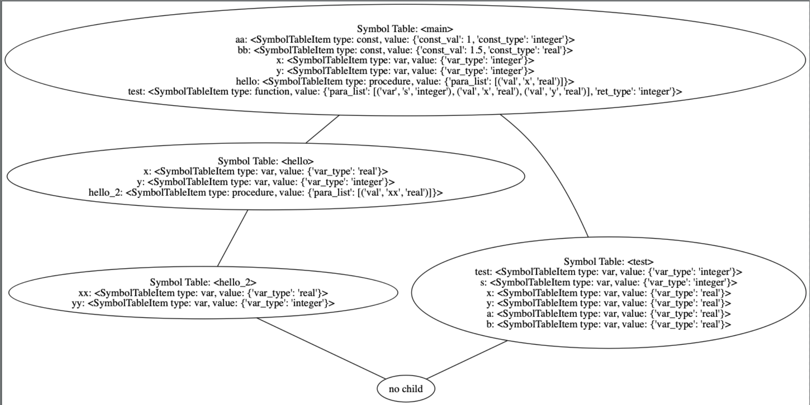
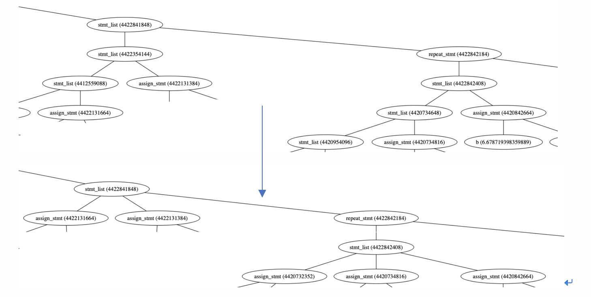
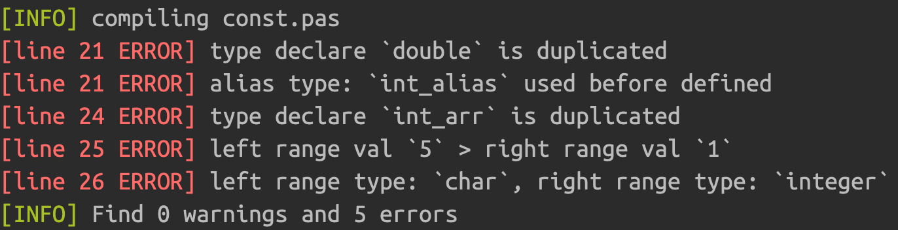
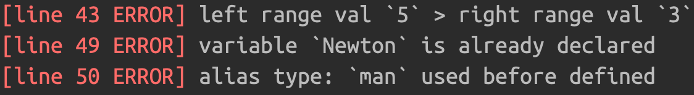
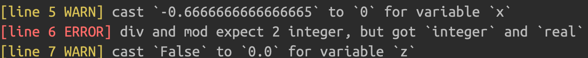
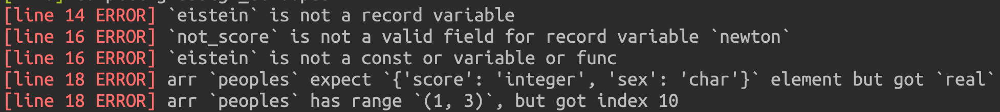
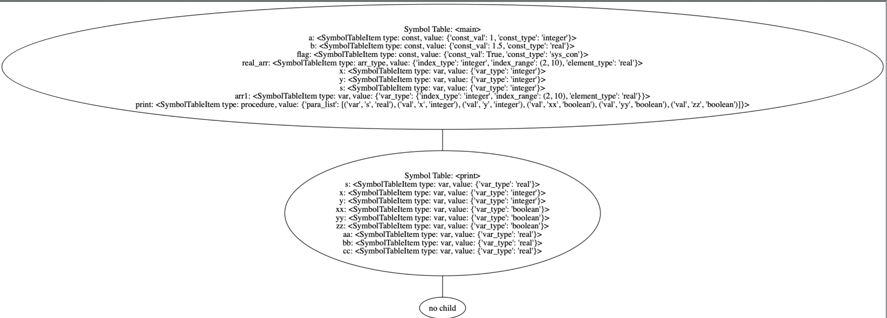
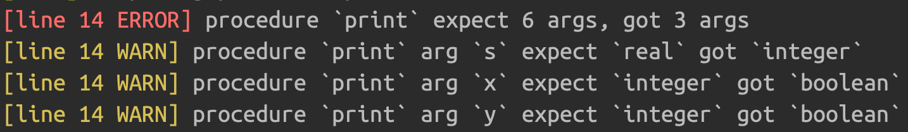

## 3  Semantic Analysis

> 李易非

### 3.1 overview

​	在 static semantic analysis 阶段，遍历基于 syntax analysis 得到的语法树，编译器将 *构建 symbol table、检查类型声明、检查变量声明、检查函数/过程声明、检查各类 statement 语句的变量定义、constant folding 以及 类型检查 ( type checking )*，经过语义分析之后，原始语法树将会进行一定程度的缩减，便于的后续代码生成流程。在接下来的小节中，**3.2** 将描述语义分析中构建的 symbol table 的数据结构与常用操作；**3.3** 将描述在语义分析过程中对语法树进行了两种优化改动；**3.4** 将具体描述在各类声明、语句中，语义分析所做的语义检查；在上述所有小节中，我们都配以相应的例子与输出结果以便理解。

### 3.2 symbol table

​	在整个语义分析过程中，编译器将动态构建 symbol table，在遍历树的整个过程中不断插入新的 symbol table 项，并利用 symbol table 进行 overview 中描述的各类检查。考虑到 pascal 语言支持嵌套的 procedure, function 定义，我们需要支持不同 scope 的 symbol table, 由于嵌套的 scope 有逻辑上的父子关系，不同 scope 的 symbol table 由树形结构进行表达，在进行诸如 *变量是否定义* 的检查过程中，可以通过当前 symbol table 结点不断上溯 parent 节点进行跨 scope 检查。




​						             **Figure 1: symbol table 树形结构示意图**

#### 3.2.1 数据结构与操作

​	symbol table 支持基础的 *insert*, *look up*, *delete* 操作，insert 操作将 key, value 对插入 symbol table 中，若 key 已经存在，则返回 None, 否则返回 value；lookup 操作在 symbol table 中搜索 key 所对应的 value，若 key 不存在返回 None；delete 操作删除 symbol table 中的 key, value 对，若 key 不存在，返回 None。

```python
class SymbolTable(object):
        
    def insert(self, key, value):
        """ insert (key, value) into symbol table 
        if the key is already in the symbol table, return None
        else return value
        """
    def lookup(self, key):
        """ lookup a key in the symbol table
        if the key is in the symbol table, return corresponding value
        else return None
        """
        
    def delete(self, key):
        """ delete a key in the symbol table
        if the key is in the symbol table, delete (key, value) and return value
        else return None
        """
        

```

​	以上 symbol table 数据结构仅能处理单一 scope 的情形，为了支持上文中描述的树形结构 symbol table，symbol table node 继承 symbol table，并增加操作 *chain_lookup* ，chain_lookup 逐级向上搜索 key, 若 key 不存在于任何一个 scope 则返回 None.

```python
class SymbolTableNode(SymbolTable):
    
    def chain_look_up(self, key):
        """ 逐层向上搜索 key
        if the key does not exist in every symbol table on the path, return None
        """
```

---


### 3.3 语义分析过程中对语法树的缩减与更改

​	为了方便后续代码生成，在语义分析过程中将对语法分析产生的语法树进行一定的缩减与更改，首先是 constant folding 操作，该操作会将可以推断结果的算式提前计算出结果，并将结果作为对应节点的子节点，在 **3.4** 我们将详细叙述这一操作；第二，由于在语法规则中有大量的左递归语法，将导致语法树的深度过高，在语义分析中 “压平” 语法树，增加其宽度，减小其深度；

#### 3.3.1 constant folding

​	grammar rules 中 expression 语法包含了所有的关系运算与算术运算，语义分析将 *后序遍历* **expression** 节点，进行最大程度的 constant 推断（部分运算中包含 var 无法进行 const folding）以及 type 检查；


​				                              **Figure 2: constant folding demo 展示 (1)** 


​								 **Figure 3: constant folding demo 展示 (2)**


​	同时，在 constant folding 过程中，语义分析将推断 expression/expr/term/factor 节点的数据类型，从而进行不同运算符的类型检查（如 *div* 运算符只能接受两个整数），以及后续的变量类型检查，type casting，我们将在 **TODO** 中详述这一过程。

#### 3.3.2 “压平”语法树

​	由于在语法规则中有大量的左递归语法，将导致语法树的深度过高，在语义分析中 “压平” 语法树，增加其宽度，减小其深度。以 stmt_list 语法为例，该语法面对大量的 statement 语句将导致树的深度过大，通过语义分析遍历树的过程中，我们可以将各个有效的后裔节点作为 stmt_list 的孩子，缩减树的深度；

```
stmt_list :  stmt_list  stmt  SEMICON
          |  empty
```



​								 **Figure 4: 压平语法树 展示	**

### 3.4 语义分析各类检查

​	这一部分将展示编译器在语义分析阶段进行的各类检查，并通过实际例子展示运行结果，完整的测试文件将在附录中提供；

#### 3.4.1 类型声明检查

​	pascal 语言支持 alias type 定义，语义分析需要检查各类 type 定义是否 *重复定义* 、 *无中生有* 以及 *数组下标非法*，下面是一段正常的 type 定义，在这段定义中，`int` 为 `integer` 类型的 alias type, `double` 为 `real` 的 alias type，`int_arr` 为 `int` 类型的数组，`int_mat` 为 `int_arr` 类型的数组（矩阵），`int_cube` 为 `int_mat` 类型的数组（三维），`people` 为 record 类型变量，`people_arr` 为 `people` 类型的数组；

```pascal
type
    int=integer;
    double=real;
    int_arr=array[1..3] of int;
    int_mat=array[1..4] of int_arr;
    int_cube=array[1..5] of int_mat;
    people=record
        score: integer;
        sex: char;
        score_arr: int_arr;
    end;
    people_arr=array[1..10] of people;
```

​	将其进行修改，产生 *重复定义* 、 *无中生有* 、*数组下标非法* 的错误

```pascal
type
    int=integer;
    double=real;
    double=integer;
    int_alias_arr=array[1..3] of int_alias;
    int_arr=array[1..3] of int;
    int_arr=array[1..3] of char;
    int_mat=array[1..4] of int_arr;
    int_cube=array[5..1] of int_mat;
    people=record
        score: integer;
        sex: char;
        score_arr: int_arr;
    end;
    people_arr=array[1..10] of people;
```



​			 		    **Figure 5: type 无中生有、重复定义、数组下标非法错误**

#### 3.4.2 变量类型检查

​	在变量定义中，语义分析将检查变量是否 *重复定义* 以及变量类型是否 *无中生有*，以下是一段正常的变量声明，变量  `x, y, z`  均为 integer 类型，`arr2` 为 下标从 '3' 到 '5'，

```pascal
var x, y, z: integer;
    arr2: array['3'..'5'] of integer;
    arr1: int_arr;
    mat1: int_mat;
    cube1: int_cube;
    Newton: people;
```

​	将其修改如下，产生 *重复定义* 、 *无中生有* 、*数组下标非法* 的错误

```pascal
var x, y, z: integer;
    arr2: array['5'..'3'] of integer;
    arr1: int_arr;
    mat1: int_mat;
    cube1: int_cube;
    Newton: people;
    Newton: real;
    yeeef: man;
```



​	 		                **Figure 6: type 无中生有、重复定义、数组下标非法错误**

#### 3.4.3 赋值语句类型检查

​	在赋值语句中，对于左值，语义分析将检查该左值是否 *定义*，*是否为不可改变的 const value*, 具体来说，在我们的语法中，有三种 assign statement grammar：

```
assign_stmt : ID  ASSIGN  expression
   			| ID  DOT  ID  ASSIGN  expression
   			| ID LB expression RB ASSIGN expression
```

​	第一种对应简单的变量赋值、第二种对应数组元素赋值、第三种对应 record field 赋值；在三种 assignment 语句中，都出现了 expression 语法，在语义分析中我们针对 expression 做了 constant folding, 将能够提前计算出运算结果的 expression 对应的语法树节点替换为运算结果，**3.3.1 ** 着重描述了这一过程。

​	在 constant folding 过程中，语义分析将推断 expression/expr/term/factor 节点的数据类型，从而进行不同运算符的类型检查（如 *div* 运算符只能接受两个整数），以及后续的变量类型检查，type casting。在运算符类型检查上，语义分析采取 **weak consistency**, 不强制要求两个算子一定是同一类型（real 类型和 integer 类型的运算）；

##### 3.4.3.1 运算符算子类型检查与结果类型推断

​	部分运算符对运算算子有类型要求，在 pascal 语法中，`div`, `mod` 运算符要求两个运算符均为整数，对于 `+`, `-`, `*`, `/` 运算符，语义分析不进行太过严格的类型检查，仅要求两个算子不能为 `char` 类型（我们的编译器不支持 string 类型）；对于关系运算符 `and`, `or`, `not`，语义分析仍不进行太过严格的类型检查，仅要求若一个算子为 `char` 类型，则另一个算子也需要为 `char` 类型；

​	结果类型推断与运算符与两个算子的类型均有关系，对于 `/` 运算符，运算结果一定为 `real` 类型；对于 `+`, `-`, `*`, 运算符，只要有一个算子为 `real` 类型，则结果为 `real` 类型；对于 `div`, `mod` 运算符，运算结果一定为 `integer` 类型；对于关系运算符 `and`, `or`, `not`, 运算结果一定为 `bool` 类型。

​	如果变量赋值语句的右值可以完全的 const fold, 语义分析还将依据变量的类型对计算结果进行 type casting, 例如，`x := 1 / 2;`, x 为 integer 变量，则语义分析将会把 0.5 cast 为 0，并在语法树中替换 expression 节点；

例如下面的程序：

```pascal
program ConstFold;
const aa = 1; bb = 1.5; flag = true;
var x, y: integer; z: real;
begin
    x := -3 + aa * 10 div 2 / bb;
	y := x + (1 + 3 mod (2 * 50 / 7));
	z := not flag and aa = 1;
end.
```



​								 **Figure 7: constant folding demo 展示 (3)**

- 变量 `x` 为 integer 类型，语义分析将自动将计算结果 -0.666 cast 为 0，并在语法树中做相应替换，见 **Figure 4**
- 变量 `y` 赋值语句中，`mod` 运算符接受了 `real` 运算符，则爆出相应错误；
- 变量 `z` 为 `real` 类型，语义分析自动将计算结果 `False` cast 为 `0.0`, 并在语法树中做相应替换；


##### 3.4.3.2 变量赋值语句左值检查

​	在 *3.2.1* 以及上小节，我们着重讲述了 const folding 以及 type inference, type cast, type check 的过程，在本部分中，我们将着重讲述变量赋值语句对左值的检查；

```
assign_stmt : ID  ASSIGN  expression
```

​	对于简单的变量赋值语句，语义分析首先通过 `chain_lookup` （变量可能存在于外 scope 中）判断变量是否存在，再如 3.2.1 所描述的 对 expression 节点进行 const fold 与 type inference，并根据 lookup 到的 variable type 来进行 type checking 与 type casting。

``` 
assign_stmt : ID  DOT  ID  ASSIGN  expression
```

​	对于 record 赋值语句，语义分析首先通过 `chain_lookup` 判断该 record 变量是否存在，再判断该 record 变量是否存在该 field，再如 3.2.1 所描述的 对 expression 节点进行 const fold 与 type inference，并根据 lookup 到的 variable type 来进行 type checking 与 type casting。

``` 
assign_stmt : ID LB expression RB ASSIGN expression
```

​	对于 array 赋值语句，语义分析首先通过 `chain_lookup` 判断该 array 变量是否存在，再解析中间的 expression 节点（对应下标），检查下标是否在该变量的下标范围之内，最后解析末尾的 expression 节点，进行 const fold 和 type casting。

例如下面的程序：

```pascal
program Arithmetic;
const a = 2; b = 3.4; c = 'l'; flag=true;
type
    int=integer;
    people=record
        score: integer;
        sex: char;
    end;
    people_arr=array [1..3] of people;
var x, y, z: integer; q:boolean; newton: people; peoples: people_arr;
begin
    q := true and true and true and not flag;
    x := (a + 13) div 5 mod 1;
    eistein.sex := 'm';
    newton.sex := 'm';
    newton.not_score := 100;
    peoples[1] := newton;
    peoples[10] := eistein;
end.
```



​								 **Figure 8: assignment 语句常见语义错误**

```pascal
program Arithmetic;
const a = 2; flag=true;
type
    int=integer;
    people=record
        score: integer;
        sex: char;
    end;
    people_arr=array [1..3] of people;
var x: boolean; q:boolean; newton: people; peoples: people_arr;
begin
    q := true and true and true and not flag;
    x := (a + 13) div 5 mod 1;
    eistein.sex := 'm';
    newton.sex := 'm';
    newton.not_score := 100;
    peoples[1] := newton;
    peoples[10] := eistein;
end.
```


 #### 3.4.3 if / while / repeat / for / case 语句语义分析与检查

​	在这一部分中，我们将讨论编译器对于 `if_stmt`, `while_stmt` , `repeat_stmt`, `for_stmt`, `for_stmt`, `case_stmt` 的语义分析与检查；

```
if_stmt :  kIF  expression  kTHEN  stmt  else_clause
repeat_stmt :  kREPEAT  stmt_list  kUNTIL  expression
while_stmt :  kWHILE  expression  kDO stmt
for_stmt :  kFOR  ID  ASSIGN  expression  direction  expression  kDO stmt
case_stmt : kCASE expression kOF case_expr_list kEND
```

​	从他们的语法规则中我们可以看到，每一个 production 所涉及的语义分析已经在之前小节基本提及，比如 if_stmt, 条件判断式为 expression 语句，语义分析只需如 *3.3.3.1* 所述的将 expression node 进行 const fold 与 type inference 即可，stmt 和 else_clause 中则包含 *3.3.2* 中所提及的各类赋值语句的语义分析；所以，对于  if / while / repeat / for / case 语句语义分析与检查本质上是在对其内部的 statement 和 expression 检查，故不做更多赘述；

#### 3.4.4 procedure / function 定义、调用语句语义分析与检查

​	procedure / func 较之前小节提到的语句更加特殊，因为 procedure 与 function 的定义语句将产生一个新的 scope, 一个新的 symble table 节点，*3.3.4.1* 将着重于 procedure / function 在定义过程中涉及的语义分析，*3.3.4.2* 将着重于 procedure / function 在调用过程中的涉及的语义分析。


##### 3.4.4.1 定义过程中涉及的语义分析

###### procedure

​	在 procedure 定义中，首先定义 procedure 传入的参数，在下面的例子中，`print` procedure 共有 6 个参数，分别为 s, x, y, xx, yy, zz，语义分析将在当前 symbol table 中插入该 procedure 的定义描述项；每个 procedure 会产生一个新的 scope, 在这个 scope 中可以定义属于这个 scope 的 constant, type, variable, procedure, function 以及后续 begin end 中的各类语句，语义分析将创建一个新的 symbol table，并将其作为之前 symbol table 的子节点；

​	对于参数定义以及声明，语义分析将进行仅限于该 scope 的语义检查（对应 symbol table 的 lookup 操作），对参数和变量声明进行 *重复定义* 与 *无中生有* 的检查；

如下面的例子，在该例子中，涉及到了两个 scope, 一个是 program 对应的 scope, 一个是 procedure print 所对应的 scope，在 print procedure 的参数定义中，出现了和主 scope 同名的变量与常数，但是语义分析仅会检查当前 scope，所以并不会报错；而在 procedure 的函数体中，出现了当前 scope 不存在的 `a` 变量，语义分析会一路上溯父亲 symbol table (chain_lookup)，检查该变量是否定义过；

```pascal
program Procedure;
const a = 1; b = 1.5; flag=true;
type
    real_arr=array[2..10] of real;
var x, y, s: integer; arr1: real_arr;

procedure print(var s: real; x, y: integer; xx,yy,zz: boolean);
var aa,bb,cc: real;
begin
	s := x * x + y * y + a;
	writeln(s);
end;
```




​	 						**Figure 9:上述例子对应的 symbol table**

###### function

​	对于 function 定义，情况基本与 procedure 相同，不同点在于 function 自己的 scope 对应的 symbol table 会事先插入与 function 同名的变量（作为返回值变量），防止后续语义分析认定返回值是未经定义的变量；


##### 3.3.4.2 调用过程中涉及的语义分析

###### procedure

​	在 procedure 的调用过程中，语义分析首先从当前 symbol table 出发，chain_lookup 检查该 procedure 是否定义，再对传入的参数进行 type 检查以及数量检查，继续从之前的 `print` 例子出发；

```pascal
program Simple;
const a = 1; b = 1.5; flag=true;
type
    real_arr=array[2..10] of real;
var x, y, s: integer; arr1: real_arr;

procedure print(var s: real; x, y: integer; xx,yy,zz: boolean);
var aa,bb,cc: real;
begin
	s := x * x + y * y + a;
	writeln(s);
end;
begin
print(a, true, false);
print(b, a, a * a, true, flag, not flag);
end.
```



​							               **Figure 10:上述例子输出结果**

​	在上述例子中，我们对 `print` procedure 进行了两次调用，第一次是错误调用，仅提供了三个参数，并且参数类型有 inconsistency，由于在我们的编译器中实行 weak consistency 的机制，参数类型错误仅会报出 warning。

###### function

​	function 调用过程涉及的语义检查与 procedure 类似，不再赘述；


